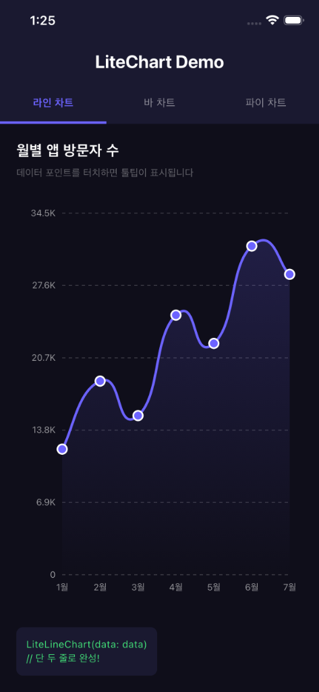
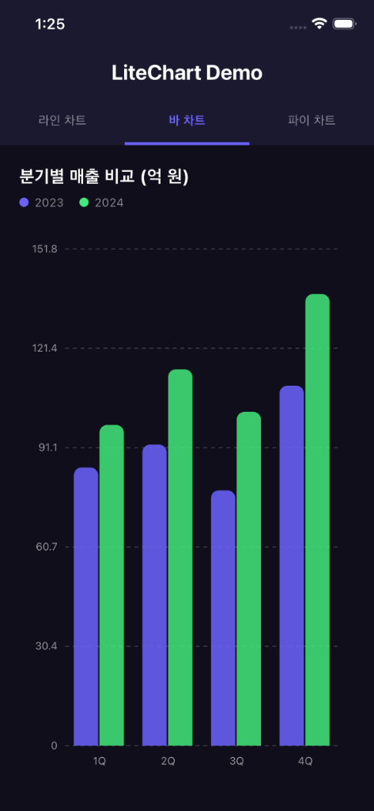
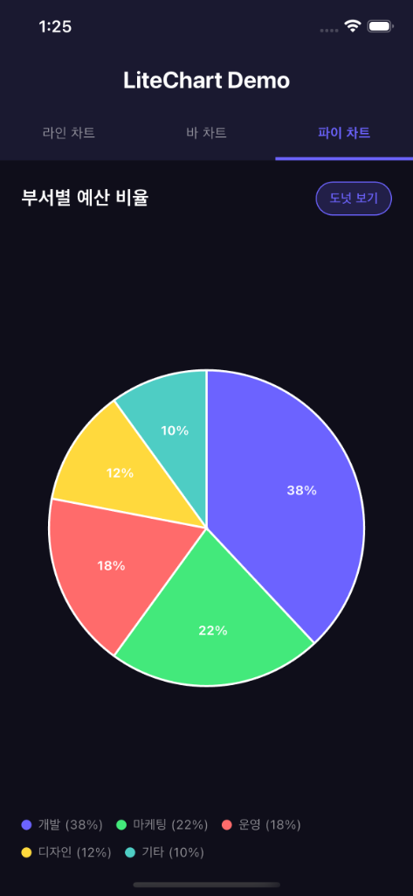
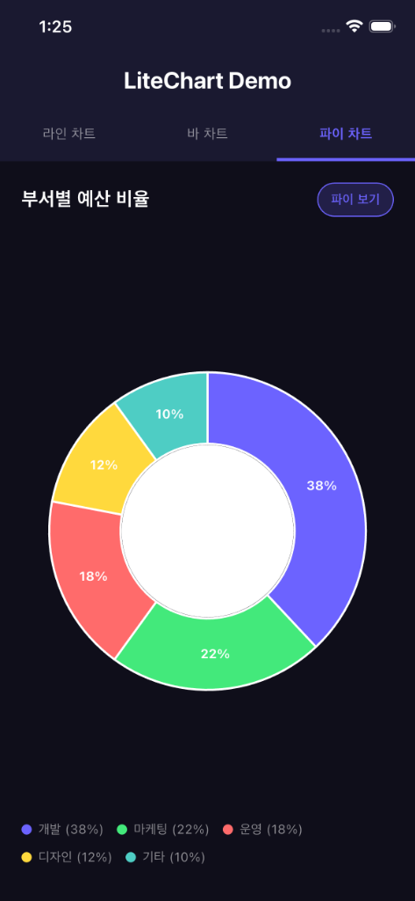

# LiteChart Flutter

> **설정은 최소화, 성능은 극대화** — 외부 의존성 없는 경량 Flutter 차트 라이브러리

[](https://pub.dev)
[](LICENSE)
[](https://flutter.dev)

---

## ✨ 특징

| 항목 | 설명 |
|------|------|
| 🚀 **성능** | `CustomPainter` + `Canvas` 직접 렌더링으로 수천 개 포인트도 프레임 드롭 없음 |
| 🎯 **간결함** | 단 두 줄 코드로 즉시 차트 생성 |
| 📦 **경량** | Flutter SDK 외 **외부 의존성 없음** |
| 🎨 **유연성** | `ChartStyle` 단일 객체로 모든 스타일 커스터마이징 |
| 📱 **반응형** | `LayoutBuilder` 기반으로 모든 화면 크기 대응 |

---

## 📸 Screenshots

| Line Chart | Bar Chart |
| :---: | :---: |
|  |  |
| **Pie Chart** | **Donut Chart** |
|  |  |

---

## 📊 지원 차트

- **라인 차트** (`LiteLineChart`) — 베지에 곡선, 그라디언트 영역, 드래그 툴팁
- **바 차트** (`LiteBarChart`) — 단일/그룹 바, 선택 팽창 효과
- **파이/도넛 차트** (`LitePieChart`) — 터치 섹션 확장, 도넛 중앙 위젯 지원

---

## 🚀 빠른 시작

### 1. 패키지 추가

```yaml
# pubspec.yaml
dependencies:
  lite_chart_flutter: ^0.1.0
```

### 2. import

```dart
import 'package:lite_chart_flutter/lite_chart_flutter.dart';
```

### 3. 라인 차트 — 최소 코드

```dart
LiteLineChart(
  data: [
    ChartData(x: 0, y: 10, label: '1월'),
    ChartData(x: 1, y: 25, label: '2월'),
    ChartData(x: 2, y: 18, label: '3월'),
    ChartData(x: 3, y: 32, label: '4월'),
  ],
)
```

### 4. 바 차트 (그룹 바)

```dart
LiteBarChart(
  series: [
    BarSeries(name: '2023', data: [
      ChartData(x: 0, y: 85, label: '1Q'),
      ChartData(x: 1, y: 92, label: '2Q'),
    ]),
    BarSeries(name: '2024', data: [
      ChartData(x: 0, y: 98, label: '1Q'),
      ChartData(x: 1, y: 115, label: '2Q'),
    ]),
  ],
)
```

### 5. 도넛 차트

```dart
LitePieChart(
  sections: [
    PieSection(value: 40, label: '식비',   color: Color(0xFF6C63FF)),
    PieSection(value: 25, label: '교통비', color: Color(0xFF43E97B)),
    PieSection(value: 35, label: '여가비', color: Color(0xFFFF6B6B)),
  ],
  // donutHoleRatio > 0 이면 도넛 차트
  style: ChartStyle(donutHoleRatio: 0.55),
  centerWidget: Text('지출', style: TextStyle(color: Colors.white)),
)
```

---

## 🎨 스타일 커스터마이징

`ChartStyle`의 `copyWith`로 필요한 속성만 변경:

```dart
LiteLineChart(
  data: data,
  style: const ChartStyle(
    palette: [Color(0xFF6C63FF)],   // 라인 색상
    lineThickness: 3.0,             // 선 두께
    smooth: true,                   // 베지에 곡선
    fillArea: true,                 // 영역 채우기
    fillOpacity: 0.2,               // 채우기 투명도
    pointRadius: 5.0,               // 데이터 포인트 크기
    gridStyle: GridStyle(
      showHorizontal: true,
      dashPattern: [4, 4],          // 대시 격자선
    ),
    axisStyle: AxisStyle(
      yLabelCount: 5,               // Y축 라벨 수
      yLabelFormatter: (v) => '${v.toInt()}K',
    ),
    tooltipStyle: TooltipStyle(
      backgroundColor: Color(0xFF1A1A2E),
    ),
    animationDuration: Duration(milliseconds: 1200),
  ),
  tooltipFormatter: (p) => '${p.label}: ${p.y.toInt()}',
)
```

---

## 📁 파일 구조

```
lib/
├── lite_chart_flutter.dart          # 패키지 진입점 (export 전용)
└── src/
    ├── models/
    │   └── chart_data.dart          # ChartData, BarSeries, PieSection
    ├── styles/
    │   └── chart_style.dart         # ChartStyle, GridStyle, TooltipStyle, AxisStyle
    ├── utils/
    │   └── chart_utils.dart         # 좌표 변환, 베지에, 대시선, 텍스트 헬퍼
    └── charts/
        ├── line_chart.dart          # LiteLineChart
        ├── bar_chart.dart           # LiteBarChart
        └── pie_chart.dart           # LitePieChart

example/
└── lib/
    └── main.dart                    # 3종 차트 데모 앱
```

---

## 📝 라이선스

MIT License — 자유롭게 사용, 수정, 배포 가능합니다.
